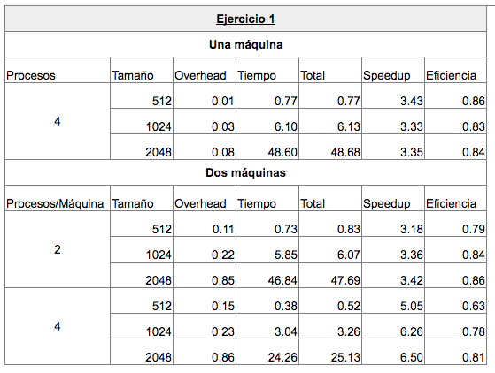
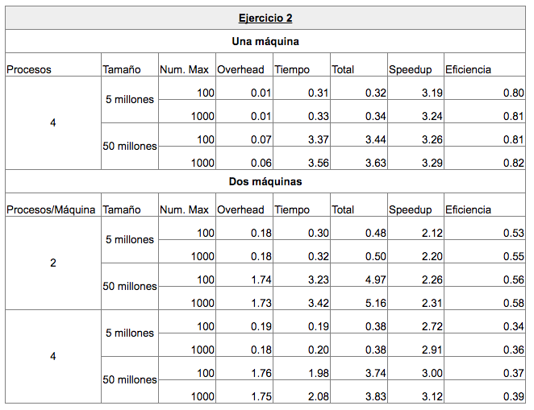
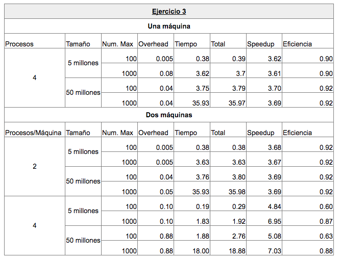

# Sistemas Distribuidos y Paralelos
## Entregable 3
### Juan Manuel Ramallo 954/1
***
## - Ejercicio 1

  **1.1 Enunciado**

  *Realizar un algoritmo MPI que resuelva la expresión: 𝑀 = 𝑑̅𝐴𝐵𝐶 + 𝑏̅𝐷𝐸𝐹, donde A, B, C, D, E y F son matrices de NxN. d̅ y b̅ son los promedios de los valores de los elementos de las matrices D y B, respectivamente.
  Evaluar N=512, 1024 y 2048.*

  **1.2 Resolución**

  - Primero que nada para mayor legibilidad y poder entender mejor el flujo del programa, se separan las acciones que deben ejecutar el proceso root, o maestro, de los procesos workers.

  - El programa empieza enviando los datos necesarios a todos los procesos disponibles para realizar los cálculos necesarios.

  - Las multiplicaciones de matrices se realizan en paralelos con todos los procesos disponibles, para lo cual antes se debió haber enviado una matriz completa y la segunda matriz en porciones usando el `MPI_Scatter`.

  **1.3 Métricas**

  - A continuación se pueden observar las mediciones tomadas en las computadoras del aula de postgrado.

  

  - El principio de localidad hace que la ejecución en dos máquinas con la misma cantidad de procesos sea mejor que con una sola, cada máquina poseerá los accesos a memoria requeridos por el programa, en posiciones contiguas de memoria.

## - Ejercicio 2

  **2.1 Enunciado**

  *Paralelizar con MPI un algoritmo que ordene un vector de N elementos por mezcla.*

  **2.2 Resolución**

  - Para mantener el codigo de la función principal más limpio, al igual que en el ejercicio 1 se separan las instrucciones que ejecutan el root y los workers en distintas funciones.

  - El root se encarga de generar el arreglo de N elementos con M como número máximo entre los numeros que contendrá el arreglo (N y M son parámetros del main)

  - Lo primero que hace el root es distribuir el arreglo entre todos los procesos
  - Luego cada proceso (incluyendo el root) ordena su porción del arreglo

  - Luego cada proceso con ID impar y el último, envía su porción ordenada y libera la memoria

  - A su vez, todos los procesos con ID par reciben los datos enviados de los impares para hacer de nuevo una ordenación por mezcla.

  - El root, al final de la ejecución, recibe todas las porciones y las ordena

  **2.3 Métricas**

  - Según la eficiencia vista, para una sola máquina los procesadores pasan más del 80% del tiempo realizando trabajo útil.
  - Para dos máquinas, se ve como decrece la eficiencia, debido a que se introduce demasiado tiempo de comunicación.

  

## - Ejercicio 3

  **3.1 Enunciado**

  *Paralelizar con MPI un algoritmo que dado un vector de números enteros encuentre los 100 elementos más frecuentes.*

  **3.2 Resolución**

  - Se hace uso de una estructura para almacenar las cuentas de cada número que aparece en el arreglo a buscar.

  - La estructura (Counter) está compuesta por dos números enteros, uno que representa el número encontrado y el otro que representa la cantidad de veces que apareció ese número en el arreglo.

  - Se implementó una función `agregar_ordenado` que agrega la cuenta de un número en un arreglo pasado como parámetro por referencia y ordena el arreglo luego de agregar, al final retorna el tamaño del arreglo; recibe los parámetros:

    - Arreglo de `Counters`
    - Numero a agregar
    - Cuenta a incrementar
    - Tamaño del arreglo de cuentas

  - El root inicializa el arreglo con N elementos con M como número máximo dentro del arreglo

  - El root reparte porciones iguales del arreglo entre todos los procesos

  - Cada proceso (incluyendo el root) cuenta las apariciones de cada número en su porción y las guarda en un arreglo de `Counters`

  - Luego se une las cuentas con el root de la misma forma que con el ejercicio anterior se unieron las ordenaciones.

  - Los procesos con ID impares envían sus cuentas y terminan, mientras los procesos pares agregan las cuentas hasta que al final envían sus cuentas al root, el cual las espera y las agrega.

  **3.3 Métricas**

  Al observar como varía el speedup para un mismo `número máximo` variando el tamaño del arreglo se puede observar que el speedup aumenta, por lo tanto se puede afirmar que al aumentar el tamaño del problema el rendimiento de la ejecución del programa mejora.

  
